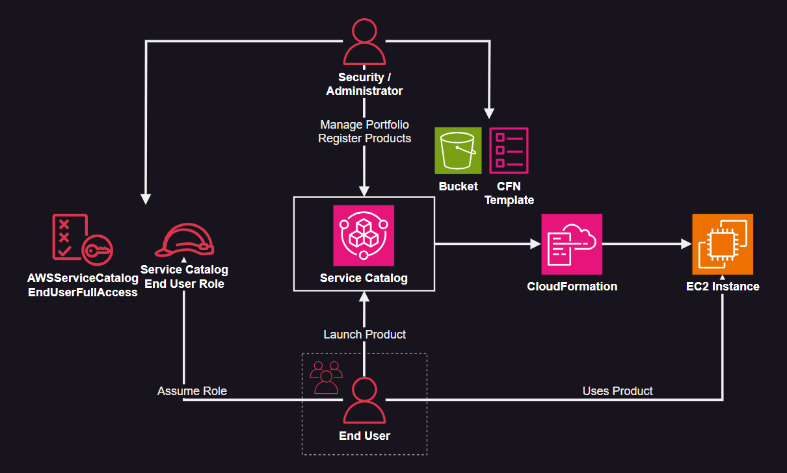
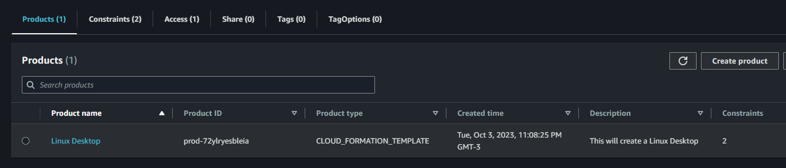

# AWS Service Catalog

Service Catalog centralized deployment of products:



Start by creating the Key Pair. This will be used during the product launch.

```sh
mkdir keys
ssh-keygen -f keys/tmp_key
```

Create the infrastructure:

```sh
terraform init
terraform apply -auto-approve
```

Enter the console with the end user credentials and you should be able to deploy a product using Service Catalog.



When launching the product, inform the Key Pair and the CIDR block allowed to connect over SSH.

---

### Clean-up

```sh
terraform destroy -auto-approve
```
