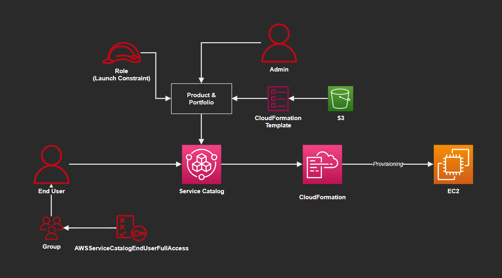
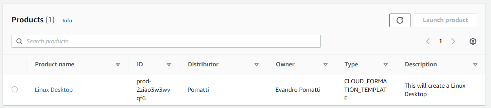

# aws-service-catalog

Service Catalog with Terraform:



Create the infrastructure:

```sh
terraform init
terraform apply -auto-approve
```

TF will output the user information for login.

Enter the console with the End-User credentials and you should be able to deploy a product using Service Catalog.



When launching the product, inform the Key Pair and CIDR block.

---

### Clean-up

```sh
terraform destroy -auto-approve
```